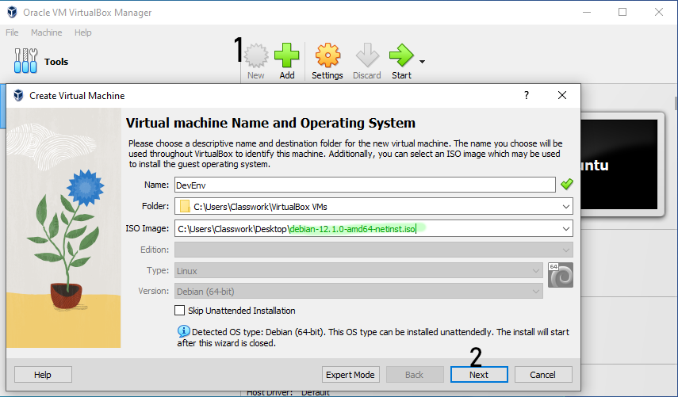

# Preamble

While using a VM is optional, it is *highly recommended*.
Making changes to your host system for the purposes of hosting server infrastructure is likely to do things you don't want.
It will also allow the development environment to more closely match the production environment, which is also a Linux VM.

# Check virtualisation support

In order to run virtual machines (VMs) your system must be configured to allow virtualisation.
This is done in the BIOS where an option to allow virtualisation is listed. The name of this option depends on your BIOS but common names are: virtualisation, SVM, AMD-V, VT-x.

Some machines are preconfigured with this option either on or off.

**For Windows**

Open task manager and check Performance→CPU for an item called "Virtualization" saying "Enabled."


This PowerShell command will also work:
```powershell
Get-ComputerInfo -property "HyperV*"
```


**For Linux**

Run this:

```bash
lscpu | grep 'Virtualization'
# Or...
grep -P 'vmx|svm' /proc/cpuinfo 1>/dev/null && echo "Enabled" || echo "Not enabled"
```


If virtualisation is not enabled you will need to go into the BIOS to enable it. 
Accessing the BIOS requires pressing a specific key during boot, but the key depends on your BIOS. Common keys are F1-12 and DEL.


# VM Installation

I'd recommend downloading the Debian ISO in advance, especially if you don't have a fast Internet connection.
Note: the DVD installer requires a Bittorrent client to download. I recommend [qBittorrent](https://www.qbittorrent.org/).

* [Net installer (decent connection)](https://cdimage.debian.org/debian-cd/current/amd64/iso-cd/debian-12.2.0-amd64-netinst.iso)
* [DVD installer (slow connection)](https://cdimage.debian.org/debian-cd/current/amd64/bt-dvd/debian-12.2.0-amd64-DVD-1.iso.torrent)

While other distributions can be used, these instructions assume the latest stable version of x86-64 Debian Linux 12 Bookworm.
Don't deviate unless you know what you're doing.

Download and install VM software. If you've installed VM software before be sure to download the latest version. This document will assume you're using VirtualBox.

* [VirtualBox](https://www.virtualbox.org/) ← Recommended for Windows host, also works on Linux
* QEMU/KVM with virtman ← Recommended for Linux host
* VMWare
* OSX options exist but I'm not aware of any

In VirtualBox or your chosen software create a new VM and provide it the ISO that was previously downloaded.
Recommended minimum specifications:
* Disk: 80 GB
* RAM: 2 GB
* vCPU: 4 (unless your host machine has less than 4)

VirtualBox has an unattended installation process which will do much of the work for you.
You can opt to bypass this if you'd prefer to configure it manually, primarily to prevent a GUI from being installed.




Start the VM and install the OS. Do not install a desktop environment (GUI) if prompted; this is not needed at all.
Username, password, hostname, etc. are all up to you.

Once installation has completed the VM will reboot.
Shut it down and configure the network into bridged mode, then start it again.


# SSH

In the terminal of the VM, run the following as root:
```bash
apt install openssh-server
```

Accessing the VM will be done via SSH. [PuTTY](https://www.chiark.greenend.org.uk/~sgtatham/putty/latest.html) is a
common choice for Windows users. Windows might have its own SSH client, too?

If your VM software does not tell you the IP address of your VM, use the `ip addr` command in the VM's terminal to find it.
It will be listed under `enp1s0` or similar, and will typically be in the form of 192.168.x.x or 10.x.x.x.


Enter the IP address into the SSH client and login to your user account.


The root account is usually disabled over SSH; use the `su root` or `sudo` command for root access after logging in.
Sudo access will need to be configured.

# Hosts file

Optionally add the VM's hostnames to your hosts file. This is for convenience only.

Launch notepad as admin and modify `C:\Windows\System32\drivers\etc\hosts` to contain your VM's IP address on Windows,
or edit `/etc/hosts` as root on Linux.
```hosts
192.168.122.155    cpsc4900.local
192.168.122.155    api.cpsc4900.local
```

# VM Software Configuration

After the OS has been installed, run the following commands as root.
This will update the software and install required packages.
```bash
apt update && apt upgrade
apt install nginx mariadb-server php8.2-fpm php8.2-pdo php8.2-mysql acl
```

Modify `/etc/php/8.2/fpm/php.ini` to enable the MySQL PDO extension if it isn't:
```ini
; Find and uncomment this line:
extension=pdo_mysql
```

1. Launch the MySQL client and login as root. The default password is blank.
2. Create the `restock` database and user and grant permissions.
3. Import the stub database structure. **This is a destructive process, it will overwrite any existing database contents!**
```bash
mysql -uroot -p
```
```sql
create database restock;
create user 'restock'@'%' identified by 'knoblauch';
grant all privileges on restock.* to 'restock'@'%';
flush privileges;
```
```bash
mysql -urestock -pknoblauch restock < database.sql
```

Create the file `/etc/nginx/sites-available/restock.conf` with the following contents:
```nginx
server {
    listen 80;
    listen [::]:80;
    listen 443 ssl;
    listen [::]:443 ssl;
    ssl_certificate ssl/cpsc4900.local.crt;
    ssl_certificate_key ssl/cpsc4900.local.key;
    server_name api.cpsc4900.local;

    root /var/www/api.cpsc4900.local/v1/public;
    index index.html index.php;

    location / {
    }

    location /api/v1 {
        try_files $uri /api.php?q=$uri&$args;
    }

    location ~ \.php$ {
        try_files $uri =404;
        include fastcgi_params;
        fastcgi_param SCRIPT_FILENAME $document_root$fastcgi_script_name;
        fastcgi_pass unix:/run/php/php-fpm.sock;
    }
}
```
And run this to enable it
```bash
cd /etc/nginx/sites-enabled
ln -s ../sites-available/restock.conf .
```

Run the following commands to create a self-signed certificate for local testing.
Note the openssl command is a multi-line command that needs to be copied in its entirety.
```bash
mkdir /etc/nginx/ssl
cd /etc/nginx/ssl
openssl req -new -newkey ec -pkeyopt ec_paramgen_curve:prime256v1 -sha256 -days 3650 -nodes -x509 \
    -keyout cpsc4900.local.key -out cpsc4900.local.crt -config <(cat <<-EOF
    [ req ]
    distinguished_name = dn
    x509_extensions = san
    prompt = no
    
    [ dn ]
    CN = cpsc4900.local
    
    [ san ]
    subjectAltName = @sans
    
    [ sans ]
    DNS.1 = cpsc4900.local
    DNS.2 = api.cpsc4900.local
EOF
)
```

Run the following commands and test the config.
```bash
systemctl reload nginx
systemctl reload php8.2-fpm
mkdir -p /var/www/api.cpsc4900.local/v1/public
echo "<?php phpinfo();" > /var/www/api.cpsc4900.local/v1/public/phpinfo.php
```

Test that it works by browsing to that file or using curl:

```bash
curl -H 'Host: api.cpsc4900.local' http://192.168.122.155/phpinfo.php
curl -k -H 'Host: api.cpsc4900.local' https://192.168.122.155/phpinfo.php
```

# Deployment Configuration

The server needs to be configured to properly accept remote deployments. This super permissive ACL will work.
Alternatively you can setgid and/or chmod 777 everything with a blank umask.
```bash
adduser restock
# Don't bother modifying any of the user information.
# Set whatever password you want.
chown restock:restock -R /var/www/api.cpsc4900.local
setfacl -Rdm www-data:rwx,g:www-data:rwx /var/www/api.cpsc4900.local
setfacl -Rm www-data:rwx,g:www-data:rwx /var/www/api.cpsc4900.local
setfacl -Rdm restock:rwx,g:restock:rwx /var/www/api.cpsc4900.local
setfacl -Rm restock:rwx,g:restock:rwx /var/www/api.cpsc4900.local
```

# PHPStorm Configuration

PHPStorm can be obtained for free as a student, all it requires is your student email address.
I highly recommend using this IDE. The necessary features likely exist in other IDEs but you're on your own for figuring that out.

## Git integration

Using git integration with the IDE is *mandatory*. Do not, I repeat, do *not* modify code files via Github's website interface.
This will be a terrible experience for everyone involved and you will be sent to the shadow realm for this transgression.

Thankfully, JetBrains has documentation for using your Github account here: https://www.jetbrains.com/help/phpstorm/github.html

Once you have git configured you can clone the project and start modifying code.
From the IDE, Git→Clone and enter the project's git URL: `https://github.com/kyutc/RestockApi.git`.

## Composer

Composer is the package manager used by the project. It manages and installs the required dependencies for the project.
It requires PHP to be installed.

You can install composer either on your local machine or the remote machine.
The difference will be where you execute the commands for composer.
I'd recommend installing composer locally since it can be integrated into the IDE that way.

[Download PHP here](https://windows.php.net/downloads/releases/php-8.2.11-nts-Win32-vs16-x64.zip). Extract this to wherever.
Add the location you extracted it to to your PATH variable. Search "Edit the system environment variables" in the start menu and open it.


Open the command prompt to test it:
```batch
php --version
```


And now [install Composer](https://getcomposer.org/Composer-Setup.exe).

Once installed, open a *new* command prompt (close the old one) and run this to test:
```batch
composer --version
```


Once Composer has been successfully installed you can begin using it with the IDE.
PHPStorm will give you execution options when you open the `composer.json` file.

Alternatively you can enter the commands manually.
The only command you'll need to execute is this in the project's base directory:
```batch
composer install
```
Note: any time `composer.json` is updated you should run this command since it'll also trigger things to regenerate the autoloader and etc.
Don't forget to also deploy these new files to the remote server.


## Remote deployment

Once you've successfully cloned the project and run `composer install` you can remotely deploy the code to the server.
This requires configuring PHPStorm to use SFTP (SSH) to transfer the files to a remote location on the server.

Access Tools→Deployment→Configuration... and click the plus symbol to add a new connection.
Click "..." next to SSH configuration to add a new SSH login.

Ensure the root path is set to `/var/www/api.cpsc4900.local/v1`.


Use the restock account and password. Be sure to click "test connection" to ensure it's working correctly.


Be sure to set the deployment path to "/".


Once done, right click the root directory in the project, "API" in my case, and go to Deployment→Upload to cpsc4900.local.
This will take a few moments to upload the entire project to the remote server.

# Test an API request

Download [curl](https://curl.se/windows/dl-8.3.0_2/curl-8.3.0_2-win64-mingw.zip) and extract the bin directory somewhere.
Do the same path environment variable thing as before, ensuring you add the `bin` directory specifically to your path.
Run `curl --version` in a *new* command prompt to verify it's working.

Once everything has been deployed to the remote server, run the following to test that it's all working correctly.

**For Windows**
```batch
curl -H "Accept: application/json" ^
     -H "X-RestockApiToken: anything" ^
     -H "Host: api.cpsc4900.local" ^
     http://192.168.122.155/api/v1/user ^
     -d "username=somebody"%random% ^
     -d "password=knoblauch"
```
**For Linux**
```bash
curl -H 'Accept: application/json' \
     -H 'X-RestockApiToken: anything' \
     -H 'Host: api.cpsc4900.local' \
     http://192.168.122.155/api/v1/user \
     -d 'username=somebody'$RANDOM \
     -d 'password=knoblauch' && echo
```
The output should be:
```json
{"result":"success"}
```

